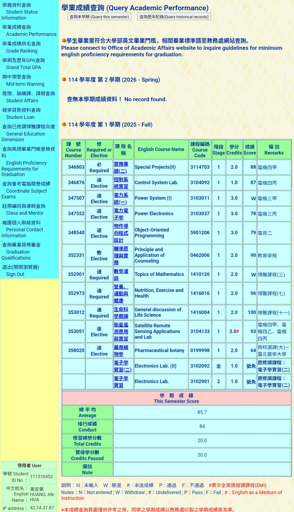

# Abstract

遊戲名稱：Angry Birds

組員：
- 111310452 黃安華
- 113590039 許兆雲

# Game Introduction
Angry Birds 是一款 2D 類型多關卡益智遊戲，玩家需要透過彈弓發射不同種類的 Angry Bird 攻擊綠色的邪惡豬大本營，但這些豬會用各種不同的材料來防禦，對應不同的建築和防禦材料，不同種類的 Angry Bird 也有不同的能力和特色去打破防禦攻擊到邪惡豬。

[遊戲連結](https://www.rovio.com/games/angry-birds-2/)
[遊戲連結](https://www.angrybirds.com/)
[遊玩畫面](https://www.youtube.com/watch?v=FSWoUGxGNEg)

# Development timeline

- Week 01：撰寫 Proposal、完成練習
  - [ ] 撰寫 Proposal
  - [ ] PTSD Giraffe 通關
  - [ ] PTSD 環境建置
  - [X] 訂定組內進度確認時間
  
- Week 02：蒐集素材
  - [ ] 項目一
  - [ ] 項目二
- Week 03：蒐集素材
  - [ ] 項目一
  - [ ] 項目二
- Week 04：製作地圖、過關動畫
  - [ ] 項目一
  - [ ] 項目二
- Week 05：製作地圖、攝影機
  - [ ] 項目一
  - [ ] 項目二
- Week 06：製作怪物
  - [ ] 項目一
  - [ ] 項目二
- Week 07：製作怪物
  - [ ] 項目一
  - [ ] 項目二
- Week 08：期中 Demo
  - [ ] 項目一
  - [ ] 項目二
- Week 09：期中 Demo
  - [ ] 項目一
  - [ ] 項目二
- Week 10：製作洛克人
  - [ ] 項目一
  - [ ] 項目二
- Week 11：製作洛克人
  - [ ] 項目一
  - [ ] 項目二
- Week 12：製作道具
  - [ ] 項目一
  - [ ] 項目二
- Week 13：製作道具
  - [ ] 項目一
  - [ ] 項目二
- Week 14：製作道具
  - [ ] 項目一
  - [ ] 項目二
- Week 15：製作第二關
  - [ ] 項目一
  - [ ] 項目二
- Week 16：製作第二關
  - [ ] 項目一
  - [ ] 項目二
- Week 17：提交
  - [ ] 拍攝影片
  - [ ] 製作遊戲簡報
  - [ ] 驗收並提交

# OOP 修課證明 (if you need)

